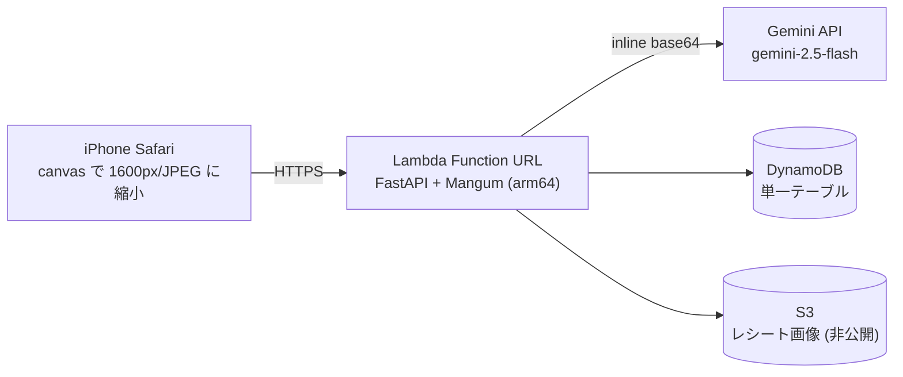

# kakeibo

> レシートを撮って、品目ごとに「子ども費 / 夫婦生活費 / 対象外」へ仕分ける、夫婦2人用の家計簿 Web アプリ（MVP）

**English summary** — kakeibo is a small serverless web app for a two-person household. You photograph a receipt with your phone, Gemini extracts the store, date and line items and proposes a category for each item (`child` / `couple` / `excluded`), and you confirm or correct the draft before it is saved. A monthly dashboard and a CSV export give you the numbers the couple needs to settle shared expenses. It runs as a single AWS Lambda behind a Function URL (FastAPI + Mangum) with DynamoDB and S3, and is sized to stay inside the AWS and Gemini free tiers. The UI and the design documents are in Japanese.

---

## 1. 何をするアプリか

もともとは、レシートを1枚ずつ目視で品目に分け、電卓で月次集計して夫婦間の費用分担を決めていた。その手作業を置き換えるのが目的。

- **撮る → AI が下書き → 人が確定**。Gemini 2.5 Flash がレシート画像から店名・日付・品目（名前 / 金額 / カテゴリ候補）を抽出し、**確認・修正画面を必ず経由してから**保存する（自動保存はしない）
- **品目単位の3分類**。`子ども費 (child)` / `夫婦生活費 (couple)` / `対象外 (excluded)` を行ごとに3択セグメントで切り替えられ、カテゴリ小計はライブ更新される
- **確認画面の実用機能**: AI が判断できなかった行は **「要確認 N 件」＋黄色ハイライト**で強調／外食レシートは **「1行にまとめる」** の1タップで単一行に集約（「内訳に戻す」で復元）／レシートを紛失した場合の **手入力登録**（画像なし）／値引き・ポイント行が対象品目と違うカテゴリにある場合の **警告表示**（保存はブロックしない）
- **月次ダッシュボード**。カテゴリ別合計カード＋日次積み上げ棒グラフ、月切替、レシート一覧（タップで品目内訳を展開・削除）
- **CSV エクスポート**。品目単位（`receipt_id, date, store, item, price, category`）、Excel で文字化けしない BOM 付き UTF-8。月指定と全期間の両方
- **共有パスフレーズ1つでログイン**。アカウント分離はない（想定ユーザーは2人）

固定費（光熱費・ネット代など）は精算対象外のため登録しない。精算額の自動計算も対象外。

## 2. アーキテクチャ



単一 Lambda にすべてのルートを載せたモノリス。API Gateway は使わず Function URL（`AuthType: NONE`）を直接公開し、認証はアプリ層の署名付き Cookie で行う。Function URL を選んだ理由は、追加課金がないことと、API Gateway の 29 秒統合タイムアウトに縛られず Lambda のタイムアウト 60 秒まで Gemini の応答を待てること。

| 区分 | 採用技術 | 備考 |
|---|---|---|
| 言語 | Python 3.12 | `.python-version` で固定。Lambda ランタイムと一致 |
| パッケージ管理 | uv | `pyproject.toml` + `uv.lock`。**pip 直接使用禁止** |
| Web フレームワーク | FastAPI（lock: 0.141.x） | `create_app()` ファクトリ |
| Lambda アダプタ | Mangum（lock: 0.22.x） | ハンドラは `kakeibo.main.handler` |
| テンプレート | Jinja2（lock: 3.1.x） | サーバーサイドレンダリング |
| フロントエンド | 素の HTML / CSS / JS | ビルドツールなし。モバイルファースト |
| グラフ | Chart.js 4（CDN） | zip に同梱しない |
| HTTP クライアント | httpx（lock: 0.28.x） | Gemini は SDK 不使用で直 REST |
| データモデル | Pydantic（lock: 2.13.x） | 構造化出力のバリデーション |
| Cookie 署名 | itsdangerous（lock: 2.2.x） | 有効期間 約90日 |
| ID 生成 | python-ulid（lock: 4.0.x） | レシート ID |
| データストア | DynamoDB 単一テーブル（PK / SK, on-demand） | 集計は Scan ベース |
| 画像 | S3（パブリックアクセス全ブロック + SSE-S3） | キー `receipts/YYYY/MM/<receipt_id>.jpg` |
| AI | Gemini 2.5 Flash（REST / 構造化出力） | HTTP タイムアウト 25 秒・リトライ1回 |
| Lint / Format | ruff | `line-length = 88` |
| テスト | pytest + moto + httpx モック | 実 AWS・実 API を叩かない |

**コスト方針**: 利用者2人・年500枚程度を想定し、**AWS 無料枠と Gemini 無料枠の範囲で月額ほぼ0円**を狙う設計（Lambda・Function URL・DynamoDB on-demand・CloudWatch Logs は無料枠内、実質 S3 ストレージだけが漸増して月0〜数十円）。無料枠の条件は変わりうるので、デプロイ時に少額の予算アラート（例: 100円）を設定すること。

## 3. 前提条件

| 必要なもの | 用途 |
|---|---|
| [uv](https://docs.astral.sh/uv/) | 依存管理・実行（pip は使わない） |
| Python 3.12 | `uv` が `.python-version` に従って用意する |
| Google AI Studio の API キー | Gemini 2.5 Flash 呼び出し（[取得はこちら](https://aistudio.google.com/apikey)） |
| **AWS CLI v2**（デプロイ時のみ） | v1 では起動時に弾かれる |
| iPhone Safari | 想定 UX。PC ブラウザでも動くが最適化していない |
| macOS（ローカル起動スクリプト） | `scripts/dev_local.sh` は `lsof` / `ipconfig` / `sips` に依存 |

ローカルで動かすだけなら AWS アカウントは不要（DynamoDB / S3 は moto で代替する）。

## 4. セットアップ

```bash
git clone <this-repo-url> kakeibo
cd kakeibo
uv sync
cp .env.example .env   # 値を埋める（.env は .gitignore 済み・コミット禁止）
```

`.env` は `set -a; . ./.env` でシェルとして読み込まれる。空白や記号を含む値はシングルクォートで囲む。

| 変数 | 意味 | 備考 |
|---|---|---|
| `SESSION_SECRET` | 署名付き Cookie の秘密鍵 | `openssl rand -hex 32` で生成する |
| `APP_PASSCODE` | 共有ログインパスフレーズ | **12文字以上**。文字種の混在は要求しないが、短いと起動時に警告ログが出る。数字だけの短いパスコードは使わない |
| `GEMINI_API_KEY` | Gemini API キー | リポジトリにコミットしない |
| `KAKEIBO_TABLE_NAME` | DynamoDB テーブル名 | ローカル既定は `kakeibo-dev`。**デプロイスクリプトは `.env` のこの値を無視する**（§8.2 参照） |
| `KAKEIBO_BUCKET_NAME` | S3 バケット名 | 同上（ローカル既定 `kakeibo-dev`） |
| `AWS_REGION` | リージョン | 未指定なら `ap-northeast-1` |
| `COOKIE_SECURE` | Cookie の `Secure` 属性 | 既定 `true`。ローカル http では `dev_local.sh` が `false` を強制する |

ログイン試行回数制限は設けていない（§10）。`APP_PASSCODE` の強度がそのまま第三者アクセスへの防御になるので、推測困難なパスフレーズを使うこと。

## 5. ローカルで動かす（AWS 不要）

```bash
bash scripts/dev_local.sh
```

このスクリプトが順に行うこと:

1. `.env` を読み込み、`SESSION_SECRET` / `APP_PASSCODE` / `GEMINI_API_KEY` が揃っているか検証する（欠けていれば中断）
2. **moto_server を `127.0.0.1:5001` で起動**し、`/moto-api/data.json` が応答するまで待つ
3. DynamoDB テーブルと S3 バケット（既定 `kakeibo-dev`）を作成する（既存ならスキップする冪等処理）
4. LAN IP を調べて **iPhone 用 URL（`http://<Mac の LAN IP>:8000/`）** と Mac 用 URL を表示する
5. **uvicorn を `0.0.0.0:8000` で起動**する（`kakeibo.main:app`）

Mac と iPhone を同じ Wi-Fi につなぎ、表示された URL を iPhone の Safari で開く。

- `http://` のままでよい。スクリプトが `COOKIE_SECURE=false` を設定するのでログイン Cookie が保存され、写真選択・撮影（`<input type="file" accept="image/*">`）も動く
- **ポート**: moto の既定は `5001`（`5000` は macOS の AirPlay レシーバーが占有しがちなため）。衝突する場合は `MOTO_PORT=5002 bash scripts/dev_local.sh`。アプリ側は `APP_PORT` で変えられる
- **停止**: `Ctrl+C`。trap で moto_server も一緒に落ちる。データは moto のメモリ上だけなので停止すると消える
- コード編集のたびに再読み込みしたい場合は、moto を使わない素の起動も可能: `uv run uvicorn kakeibo.main:create_app --factory --reload`（この場合 AWS 接続先は自分で用意する）

## 6. テスト

```bash
uv run pytest -q
uv run ruff check . && uv run ruff format --check .
```

テストは moto（DynamoDB / S3）と httpx モック（Gemini）で完結し、**実 AWS・実 API には一切接続しない**。カバレッジを見る場合は `uv run pytest --cov=src --cov-report=term-missing`。

## 7. 実 Gemini スモーク（手動）

プロンプトと分類ルールの当たりを見るため、実レシート2〜3枚を実 API に通す。pytest には含まれない唯一の実 API 呼び出し。

```bash
uv run python scripts/smoke_gemini.py receipt1.jpg receipt2.png
```

- `GEMINI_API_KEY` は環境変数、なければ `.env` から読む（環境変数が優先）
- iPhone の **HEIC はそのまま渡せる**（`.heic` / `.heif` → `image/heic`。`.jpg` / `.jpeg` / `.png` も対応、それ以外の拡張子は `image/jpeg` 扱い）。変換したい場合は `sips -s format jpeg in.heic --out out.jpg`
- 出力で見るところ: 品目ごとの **`要確認` マーク**（`uncertain`）の数と場所、**警告** の内容、合計と品目合計の一致、所要時間、末尾の raw JSON。分類が意図とずれていたら `docs/02_functional_design.md` §5.2 のプロンプトを直す

## 8. AWS にデプロイする

### 8.1 アカウントの準備

**個人用の AWS アカウントを使うこと。** 実行者には DynamoDB・S3・IAM・Lambda の作成／参照／設定権限と、作成した実行ロールに対する `iam:PassRole` が必要。

```bash
aws configure --profile <your-profile-name>
export AWS_PROFILE=<your-profile-name>

aws --version                  # aws-cli/2.x であること
aws sts get-caller-identity    # 想定どおりのアカウントか確認する
```

`.env` に `SESSION_SECRET` / `APP_PASSCODE` / `GEMINI_API_KEY` が入っていること（未記載なら環境変数から読む）。本番の `COOKIE_SECURE` はスクリプトが常に `true` を設定する。

### 8.2 リソース名の既定値

`.env` の `KAKEIBO_TABLE_NAME` / `KAKEIBO_BUCKET_NAME` はローカル用（`kakeibo-dev`）なので、**デプロイスクリプトは dotenv 由来のリソース名を捨てる**。本番名はシェルの環境変数か、以下の既定値で決まる。

| 設定 | 未指定時の既定 |
|---|---|
| `AWS_REGION` | `ap-northeast-1`（`AWS_DEFAULT_REGION` も可） |
| `KAKEIBO_TABLE_NAME` | `kakeibo` |
| `KAKEIBO_BUCKET_NAME` | `kakeibo-<your-account-id>-<region>` |
| `KAKEIBO_FUNCTION_NAME` | `kakeibo` |
| `KAKEIBO_ROLE_NAME` | `<function-name>-lambda` |

変えたい場合は `export KAKEIBO_BUCKET_NAME=...` のようにシェルで指定する（明示的な環境変数が `.env` より優先される）。

### 8.3 初回構築

```bash
bash scripts/bootstrap_aws.sh
```

冪等。既存リソースは作り直さず、途中で中断しても再実行できる。行うこと:

1. AWS CLI v2 と `uv` の存在確認、呼び出し元アカウント・パーティションの解決
2. Lambda 関数が未作成なら、先に `scripts/deploy.sh --build-only` で `lambda.zip` を作る（パッケージング失敗時に AWS 側へ中途半端なリソースを残さないため）
3. **DynamoDB テーブル**作成（PK / SK, `PAY_PER_REQUEST`）
4. **S3 バケット**作成 + パブリックアクセス4項目のブロック + SSE-S3 既定暗号化（不足していれば補完する）
5. **IAM ロールとインラインポリシー `kakeibo-runtime`** 作成（テーブル・`receipts/*` オブジェクト・自関数のロググループに限定）。IAM の伝播待ちはリトライする
6. **Lambda 関数**作成（`python3.12` / `arm64` / handler `kakeibo.main.handler` / timeout 60秒 / memory 512MB / 環境変数一式）
7. **Function URL**（`AuthType: NONE`）作成と、[URL 経由の呼び出しに必要な2つの権限](https://docs.aws.amazon.com/lambda/latest/dg/urls-auth.html)（`lambda:InvokeFunctionUrl` と `lambda:InvokeFunction` + `--invoked-via-function-url`）の付与
8. 最後に **Function URL を出力**する

出力された HTTPS URL を iPhone Safari で開き、ログインとレシート保存を確認する。

### 8.4 更新

```bash
bash scripts/deploy.sh              # zip をビルドして Lambda のコードを更新
bash scripts/deploy.sh --env        # コードに加えて環境変数も更新
bash scripts/deploy.sh --build-only # AWS に接続せず lambda.zip を作るだけ
```

ビルドは `pyproject.toml` の実行時依存から boto3 / botocore を除き、`uv.lock` のバージョンを制約に **Python 3.12 / aarch64-manylinux2014 の wheel のみ**で `build/` に展開して zip 化する。dev 依存・`tests`・`__pycache__`・`.pyc` は除外される（boto3 は Lambda ランタイム同梱版を使う）。`--build-only` を付けた場合は AWS 接続も `.env` 読み込みも行わない。

`--env` は Lambda の環境変数を `SESSION_SECRET` / `APP_PASSCODE` / `GEMINI_API_KEY` / `KAKEIBO_TABLE_NAME` / `KAKEIBO_BUCKET_NAME` / `COOKIE_SECURE=true` の6つで**丸ごと置き換える**。

**パスフレーズのローテーション**: `.env` の `APP_PASSCODE` を新しい値にして `bash scripts/deploy.sh --env` を実行する。Cookie の署名ペイロードにパスフレーズ指紋が含まれているため、反映後は **全端末が即時ログアウト**する（ログアウト機能の代わりでもある）。

### 8.5 予算アラート

無料枠の条件は変わりうる。[Lambda](https://aws.amazon.com/lambda/pricing/) / [DynamoDB](https://aws.amazon.com/dynamodb/pricing/) / [AWS 無料利用枠](https://aws.amazon.com/free/free-tier-faqs/) / [Gemini](https://ai.google.dev/gemini-api/docs/pricing) の最新条件を確認したうえで、AWS Billing で少額（例: 100円）の予算アラートを設定しておくこと。

### 8.6 撤去

保存データも消えるので、必要なら先に CSV（`GET /export.csv?month=all`）と S3 画像を退避する。

1. 対象のアカウント・リージョン・リソース名を再確認する（リージョン指定の操作には作成時と同じ `--region` を渡す）
2. `aws lambda delete-function-url-config --function-name <function-name>` → `aws lambda delete-function --function-name <function-name>`
3. `aws iam delete-role-policy --role-name <role-name> --policy-name kakeibo-runtime` → `aws iam delete-role --role-name <role-name>`
4. `aws dynamodb delete-table --table-name <table-name>`
5. `aws s3 rm s3://<bucket-name> --recursive` → `aws s3api delete-bucket --bucket <bucket-name>`（後からバージョニングを有効にした場合は旧バージョンと削除マーカーも消す）
6. `aws logs delete-log-group --log-group-name /aws/lambda/<function-name>`

## 9. ドキュメント

このリポジトリは仕様文書が正で、実装と食い違ったら文書を先に直す方針で作られている。

| 文書 | 答える問い |
|---|---|
| [docs/01_product_requirements.md](docs/01_product_requirements.md) | 誰の何の課題を解くか・スコープ / 非スコープ（プロダクト要求定義書） |
| [docs/02_functional_design.md](docs/02_functional_design.md) | 画面・API・データモデル・Gemini プロンプトの詳細（機能設計書） |
| [docs/03_tech_spec.md](docs/03_tech_spec.md) | 技術選定・AWS 構成・パッケージング・認証（技術仕様書） |
| [docs/04_repository_structure.md](docs/04_repository_structure.md) | どのコードがどこにあるか・レイヤ規則（リポジトリ構造定義書） |
| [docs/05_development_guidelines.md](docs/05_development_guidelines.md) | コーディング規約・テスト方針・Definition of Done（開発ガイドライン） |

`docs/phase-b-plan.md` はコア実装フェーズの作業計画（実装時の成果物）であり、仕様の正本ではない。

レイヤ規則は **`routers → services → repositories` の一方向**で、逆方向の import は禁止。boto3 を触ってよいのは `repositories/` だけ。

## 10. 制限事項・既知の注意点

- **アカウント機能はない**。共有パスフレーズ1つで、誰がどのレシートを登録したかは区別しない
- **ログイン試行回数制限・ロックアウトを意図的に設けていない**。利用者2人の想定では締め出し事故のリスクの方が現実的という判断で、総当たり耐性はパスフレーズの長さ（12文字以上）に委ねている。公開 URL に置く以上、短い数字パスコードは使わないこと
- **集計は DynamoDB の Scan ベース**。年500レシート程度（1MB/年未満）を前提にした割り切りで、データが増えたら `MONTH#YYYY-MM` を PK とする GSI を足す拡張パスになる
- **レシートを削除しても S3 の画像は残る**。削除するのは DynamoDB のレコードのみ
- **Gemini の抽出精度はレシートのレイアウト依存**。税抜表示や特殊な明細で品目合計とレシート合計がずれることがあり、警告は出すが保存はブロックしない。判断できなかった品目は `uncertain` として黄色ハイライトされるので、そこを人が直す前提の設計
- **iOS Safari はタブを切り替えるとページを再読み込みすることがある**。その場合、確認・修正ビューの下書きと保持中の画像 Blob は失われる（撮り直しになる）。MVP では許容
- 画像は保存確定時にだけ S3 へ書かれるため、確認画面を離脱しても孤児画像は発生しない
- 固定費の登録、精算額の自動計算、ネイティブアプリ、複数世帯対応、口座・カード明細連携はスコープ外

## 11. ライセンス

MIT License（LICENSE ファイル参照）
