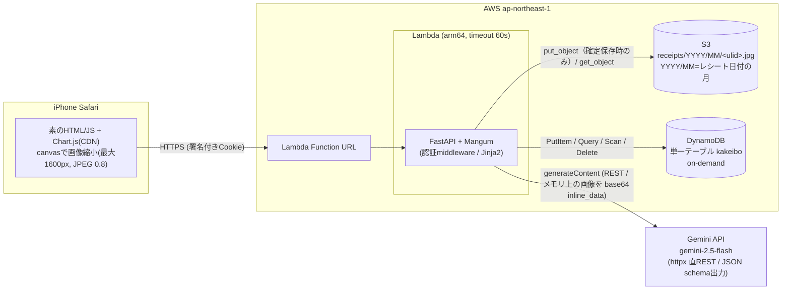
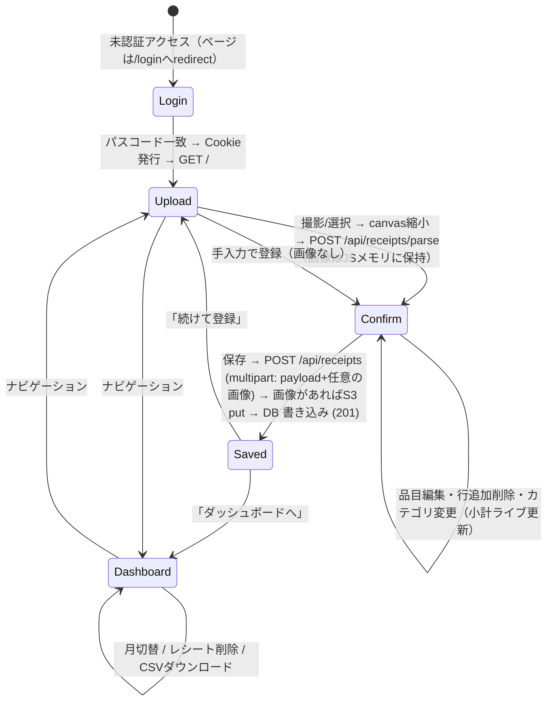

# 02. 機能設計書（Functional Design）

kakeibo — 夫婦2人用 家計簿Webアプリ MVP の機能設計書。
本書は 7 文書のうち最も詳細な文書であり、実装（Phase B 以降）の直接の仕様となる。

- 対象読者: 実装者（Claude / Codex）、レビュアー（ユーザー）
- 上位文書: [01_product_requirements.md](./01_product_requirements.md)
- 関連文書: [03_tech_spec.md](./03_tech_spec.md)、[04_repository_structure.md](./04_repository_structure.md)

---

## 1. システム構成図



構成上のポイント:

| 項目 | 内容 |
|---|---|
| 入口 | Lambda Function URL 1本。API Gateway は使わない |
| アプリ | FastAPI を Mangum で Lambda に載せる。HTML ページも API も同一アプリが返す |
| 画像 | クライアントで縮小済み JPEG（200〜600KB）を multipart で受ける。解析時は Lambda メモリ上で Gemini に渡すだけで、**S3 への永続保存は確定保存時のみ** |
| 解析 | Lambda から Gemini API を httpx 直 REST で呼ぶ（SDK 不使用、構造化出力） |
| データ | DynamoDB 単一テーブル。解析ドラフトは DB にも S3 にも保存せず、保存確定時のみ書き込む |
| 秘密情報 | `GEMINI_API_KEY` / `SESSION_SECRET` / `APP_PASSCODE` は Lambda 環境変数（MVP） |

---

## 2. 画面フローと画面設計

### 2.1 画面フロー



- Upload → Confirm → Saved は **同一ページ `GET /` 内のビュー切替**（SPA的にJSで切り替える。ページ遷移なし）。
- 解析失敗（502）時も Confirm ビューへ進む（空の手入力モード。縮小済み画像 Blob は JS メモリに保持したままなので、手入力後に通常どおり保存できる。5.4 参照）。
- Cookie 期限切れ時: ページ遷移は `/login` へリダイレクト、fetch (`/api/*`) は 401 を受けて JS が `/login` へ誘導する。

### 2.2 画面一覧

| 画面 | パス | 内容 |
|---|---|---|
| ログイン | `GET /login` | 共有パスコード入力 |
| アップロード（確認・修正ビューを含む） | `GET /` | 撮影 → 解析、または「手入力で登録」→ 確認・修正 → 保存（モックアップ・要素仕様は 2.4） |
| ダッシュボード | `GET /dashboard` | 月次集計・グラフ・レシート一覧・CSV |

### 2.3 ログイン画面（`/login`）

```
+----------------------------------+
|  kakeibo                         |
|                                  |
|  パスコード                       |
|  [ ____________ ] (type=password,|
|     autocomplete=current-password)|
|                                  |
|  [ ログイン ]  (幅いっぱい)        |
|                                  |
|  (!) パスコードが違います ← 失敗時 |
+----------------------------------+
```

- 単一フォーム。POST 先は `/login`。成功で `Set-Cookie` + `303 See Other` → `/`。
- パスコードは英数12文字以上のパスフレーズのため数字キーボード固定にはせず、`autocomplete="current-password"` で iPhone のキーチェーン保存・自動入力を効かせる（6.1 の設計判断）。
- 失敗時は同ページ再表示＋エラーメッセージ（試行回数制限・ロックアウトは設けない。6.1 の設計判断を参照）。

### 2.4 アップロード画面（`/`）— 3ビュー構成

**ビュー1: アップロード**

```
+----------------------------------+
|  レシート登録        [📊 集計]    |
|                                  |
|  +----------------------------+  |
|  |   📷 レシートを撮影 / 選択    |  |
|  |  (input type=file           |  |
|  |   accept="image/*")         |  |
|  |   ※capture 属性は付けない   |  |
|  +----------------------------+  |
|  [ 手入力で登録 ]                |
+----------------------------------+
```

アップロードビューの要素仕様:

| 要素 | 仕様 |
|---|---|
| 画像選択 | `input id="file" type="file" accept="image/*"`。撮影または写真選択後に解析する |
| 手入力で登録 | 画像選択の隣に `button id="manual-entry" type="button"`。画像選択・解析なしで確認・修正ビューを開く |

- `<input type=file>` に `capture` 属性は付けない。iOS Safari では `capture` があるとカメラ起動のみになり写真ライブラリを選べないため、属性なしで「写真ライブラリ / 写真を撮る」の選択シートを出す（2026-09-13 実機確認）。
- ファイル選択後、JS が canvas で長辺 1600px 以下・JPEG 品質 0.8 に縮小（HEIC → JPEG 変換もこの過程で解決）。
- 縮小後 `POST /api/receipts/parse` を送信し、ビュー2（解析中）を表示。縮小済み JPEG の Blob は **保存完了まで JS メモリに保持**する（確定保存時に同じ Blob を送る）。
- 手入力モードの入口は **解析失敗（502）または明示的な「手入力で登録」ボタン**。ボタンから開く場合は今日の JST 日付・店名空・合計 0・空の品目1行（price=0、category=couple、uncertain=false）・警告なしで開始し、画像 Blob は保持しない。502 時は従来どおり画像 Blob と解析失敗の警告を保持する。

**ビュー2: 解析中**

- スピナー＋「レシートを解析しています…」。応答（成功/失敗）でビュー3へ。

**ビュー3: 確認・修正ビュー**（本アプリの中心画面）

```
+----------------------------------+
|  内容の確認                       |
|                                  |
|  (!) 品目合計 1,638円 がレシート   |
|      合計 1,738円 と一致しません   |   ← warnings がある場合のみ
|                                  |
|  (!) 要確認 1 件（黄色の行）        |   ← uncertain が1件以上ある場合のみ
|                                  |
|  日付  [ 2026-08-25 ] (type=date)|
|  店名  [ 西松屋　　　 ]           |
|                                  |
|  ── 品目 ──────────────────────  |
|  [おむつM        ] [ 1480]  [✕] |
|  ( 子 | 夫婦 | 外 )  ←3択セグメント|
|  --------------------------------|
|▓ [ﾊﾝｶﾁ          ] [  258]  [✕] |  ← uncertain=true の行は
|▓ ( 子 | 夫婦 | 外 )              |     黄色ハイライト
|  --------------------------------|
|  [ポイント利用    ] [ -100]  [✕] |
|  ( 子 | 夫婦 | 外 )              |
|                                  |
|  [+ 行を追加]                     |
|                                  |
|  ── 小計（ライブ更新）──────────  |
|  子ども費   1,480円               |
|  夫婦生活費   258円               |
|  対象外      -100円               |
|  合計       1,638円               |
|                                  |
|  [ 保存する ]      [ やり直す ]    |
+----------------------------------+
```

確認・修正ビューの要素仕様:

| 要素 | 仕様 |
|---|---|
| 警告表示 | サーバの `warnings[]` を保持し、クライアント警告と合わせて画面上部の黄色帯に表示。カテゴリごとに `price < 0` の品目行があり、同じカテゴリに `price > 0` の品目行がない場合、該当する負数行ごとに「値引き行（<name> <price>円）が <カテゴリ表示名> にありますが、<カテゴリ表示名> の品目がありません。値引きは対象品目と同じカテゴリにしてください。」を表示（child=子ども費、couple=夫婦生活費、excluded=対象外）。品目合計とレシート合計の不一致警告と同様に、入力・カテゴリ変更・行追加削除・1行にまとめる・内訳復元のたびに再計算。保存はブロックしない（2026-09-13 決定） |
| 要確認バッジ | `items[].uncertain == true` の行数を画面上部に「要確認 N 件」と表示。0 件なら非表示。ユーザーはこの行を重点的に 3択で修正する |
| 日付 | `input type=date`。Gemini 抽出値を初期表示。必須 |
| 店名 | テキスト入力。空でも保存可（空文字は `""` で保存） |
| 品目行 | 品目名（テキスト）／金額（`inputmode=numeric`、整数円、負数可＝値引き行）／削除ボタン |
| 3択セグメント | `子`(child) / `夫婦`(couple) / `外`(excluded)。行ごとに1つ選択。タップ面付き44px以上 |
| uncertain 行ハイライト | `uncertain: true` の品目行（品目名・金額・3択セグメント）を黄色背景で表示。ユーザーがその行の3択を操作したらハイライトを解除する。`uncertain` は表示専用で、`POST /api/receipts` には送らない（DB にも保存しない） |
| 小計ライブ表示 | 入力・カテゴリ変更のたびに JS がカテゴリ別小計と全体合計を再計算して即時表示 |
| 1行にまとめる | ボタン `id="collapse-items"`。現在の品目行を JS メモリに退避し、品目名=`<店名>`（店名が空なら `まとめ`）、金額=現在のレシート記載合計欄の値（品目合計ではない）、category=couple、uncertain=false の1行に置換。小計・合計不一致の警告帯・要確認件数を既存のライブ処理で再計算する。ボタンは「内訳に戻す」に切り替わり、再タップで退避した内訳を復元する |
| 行追加 | 空行（name="", price=0, category=couple, uncertain=false）を末尾に追加 |
| 行削除 | 該当行を即時削除（確認ダイアログなし。保存前なので取り返しがつく） |
| 保存 | `POST /api/receipts`（`multipart/form-data`: `payload` JSON + メモリ保持中の縮小画像 `file`（任意）。画像なしの手入力時は `file` を送らない）。成功で「保存しました」トースト → ビュー1へ戻る（またはダッシュボードへのリンク表示） |
| やり直す | ドラフトと保持中の画像 Blob を破棄してビュー1へ戻る（S3・DB とも何も書かれない＝孤児画像は発生しない） |
| 冪等化トークン | 確認・修正ビューを開いた時点（解析成功・502後の手入力・ボタンからの手入力のいずれも）で JS が `client_token`（UUID v4）を**1回だけ**生成して保持し、保存リクエストの `payload` に載せる。再送信でも同じ値を使い、二重登録を防ぐ（4.5）。「やり直す」で開き直した場合は新しい値を生成する |
| 画像の保持 | 縮小済み JPEG の Blob を保存完了まで JS メモリに保持する。iOS Safari はタブ切替でページを再読み込みすることがあり、その場合 Blob もドラフトも失われる（ユーザーは撮り直す。MVP では許容） |

**1行にまとめる状態（2026-09-13 決定）**: 退避するのはタップ時点の編集中の品目名・金額・カテゴリ・uncertain。まとめた行を編集・削除したり、新しい行を追加しても「内訳に戻す」の状態を維持する。復元時はまとめた後の編集・追加行を破棄し、退避した内訳だけを戻す（日付・店名・レシート記載合計欄は戻さない）。スナップショットは保存成功時・「やり直す」で破棄し、新しい確認ビューは通常状態で開く。保存失敗時は保持する。

**理由**: 外食は品目単位で分ける必要がなく、税抜品目表示による合計不一致も回避できる。人が1タップで決める（Geminiに店種判定はさせない）。

### 2.5 ダッシュボード画面（`/dashboard`）

```
+----------------------------------+
|  集計              [＋ 登録へ]    |
|                                  |
|  [◀]  2026年8月  [▶]   ← 月切替  |
|                                  |
|  +-------------+  +------------+ |
|  | 子ども費      |  | 夫婦生活費   | |
|  |  12,480円    |  |  38,920円   | |
|  +-------------+  +------------+ |
|                                  |
|  ▓▓ 日次積み上げ棒グラフ ▓▓        |
|  (Chart.js stacked bar,          |
|   X=日付, 系列=child/couple)      |
|                                  |
|  [ CSVダウンロード (この月) ]      |
|                                  |
|  ── レシート一覧 ───────────────  |
|  8/25 西松屋      1,638円  [削除] |
|    子ども費 1,480円 夫婦生活費 258円 |
|    対象外 -100円（控えめに表示）  |
|  8/24 ライフ      3,210円  [削除] |
|  ...                             |
+----------------------------------+
```

| 要素 | 仕様 |
|---|---|
| 月切替 | `◀`/`▶` で前後の月へ。JS が `GET /api/summary?month=YYYY-MM` を再取得して描画 |
| カテゴリ合計カード | 当月の child / couple 合計。excluded は表示しない（合計にも含めない） |
| 日次積み上げ棒グラフ | Chart.js（CDN）。X軸=日、系列=child/couple の積み上げ |
| CSVリンク | `GET /export.csv?month=YYYY-MM`（`all` 版のリンクも小さく併記）。行は `date` 昇順 → `receipt_id` 昇順 → `seq` 昇順（4.8） |
| レシート一覧 | 当月のレシートを `date` 降順 → `receipt_id` 降順（4.7）。行タップで品目内訳を展開表示（アコーディオン）。内訳は `GET /api/summary` の `receipts[].items` をそのまま使い、**追加の API 呼び出しは行わない** |
| レシート別小計 | 店名・日付・記載合計に加え、`receipts[].subtotals` の「子ども費 N円」「夫婦生活費 N円」を小さく表示する。excluded が 0 以外なら「対象外 N円」を灰色で表示する（負数も表示）。全品目が対象外でも金額を確認できる |
| 対象外の品目内訳 | 展開した excluded の行は灰色で表示し、品目名に「対象外」ラベルを付ける |
| 削除 | `confirm()` ダイアログ後 `DELETE /api/receipts/{id}`。成功で一覧・集計を再取得 |

---

## 3. DynamoDB テーブル設計

### 3.1 テーブル定義

単一テーブル `kakeibo`、オンデマンド（常時無料枠内）。

| Entity | PK | SK | 属性 |
|---|---|---|---|
| Receipt | `RECEIPT#<ulid>` | `META` | `date` (YYYY-MM-DD), `store`, `total` (int円), `s3_key`（省略可）, `created_at` (ISO8601・JST `+09:00`), `client_token` (UUID v4・冪等化キー。4.5) |
| LineItem | `RECEIPT#<ulid>` | `ITEM#<seq 3桁>` | `name`, `price` (int円・値引きは負数可), `category` (`child`/`couple`/`excluded`), `date` (非正規化), `store` (非正規化) |

- `<seq 3桁>` は `001`, `002`, … のゼロ埋め。SK ソートで品目の表示順が保たれる。1レシートあたり最大 **999 品目**（4.5 でバリデーション）。
- `s3_key` は `receipts/YYYY/MM/<ulid>.jpg`。`YYYY/MM` は**レシート日付（`date`）の年月**であり、アップロードした月ではない。
- 画像なしの手入力レシートは META の `s3_key` 属性を省略する（DynamoDB に null を書かない）。対応する S3 オブジェクトは存在しない。
- 個人識別は要件でないため `created_by` は持たない（従来は常に `"shared"` 固定だった）。将来アカウントを分ける場合に追加する。
- LineItem に `date`・`store` を非正規化して持つのは、集計・CSV 出力を LineItem だけで完結させるため（META との JOIN 相当を不要にする）。CSV の `store` 列も LineItem の値をそのまま使う（4.8）。
- 1レシート = META 1件 + ITEM n件 を保存確定時に一括 PutItem（`BatchWriteItem`。25件/リクエストのチャンク分割と部分失敗時の後始末は 4.5）。解析ドラフトは DB にも S3 にも保存しない（画像は確定保存時に初めて S3 に書かれる）。

アイテム例:

```json
{ "PK": "RECEIPT#01J5ZC8YV3Q4R6T8W9XABCDEF0", "SK": "META",
  "date": "2026-08-25", "store": "西松屋", "total": 1638,
  "s3_key": "receipts/2026/08/01J5ZC8YV3Q4R6T8W9XABCDEF0.jpg",
  "created_at": "2026-08-25T10:12:34+09:00",
  "client_token": "6f1d2c1e-6a5b-4e2f-9c3a-8b7d5e4f1a20" }

{ "PK": "RECEIPT#01J5ZC8YV3Q4R6T8W9XABCDEF0", "SK": "ITEM#001",
  "name": "おむつM", "price": 1480, "category": "child",
  "date": "2026-08-25", "store": "西松屋" }
```

### 3.2 ID 設計 — ULID 採用理由

- レシートIDは **ULID**。UUID と同じ128bitだが先頭48bitがタイムスタンプのため **辞書順 = 時系列順** になる。
- これにより PK の一覧を並べるだけで作成順ソートが得られ、追加のソートキーや GSI なしで「新しい順のレシート一覧」を実現できる。
- 衝突耐性は UUID 同等で、クライアント連携なしにサーバ側で採番できる。

### 3.3 集計は Scan ベースで割り切る（根拠）

- 想定規模: 年間 約500レシート × 平均6品目 = 約3,500 アイテム ≈ **1MB/年 未満**。
- DynamoDB Scan は 1MB/ページなので、数年分でも数ページで完了する。Lambda 内の月次フィルタ（`date` が対象月に一致する LineItem の抽出）で十分速く、RCU も無料枠に収まる。
- したがって MVP では **GSI を作らず全件 Scan → アプリ側でフィルタ・集計** とする。

### 3.4 将来の拡張パス（GSI）

データが増えて Scan が重くなった場合の移行先を先に定義しておく:

| 項目 | 内容 |
|---|---|
| GSI 名 | `month-index` |
| GSI PK | `month` = `MONTH#YYYY-MM`（LineItem / META に属性を追加） |
| GSI SK | `date`（または `PK` そのまま） |
| 移行手順 | (1) 書き込み時に `month` 属性を付与開始 → (2) 既存アイテムへバックフィル Scan+Update → (3) 集計を Query(`month-index`) に切替 |

---

## 4. API 仕様

### 4.1 エンドポイント一覧

| メソッド | パス | 認証 | 概要 |
|---|---|---|---|
| GET | `/login` | 不要 | ログインページ |
| POST | `/login` | 不要 | パスコード検証 → 署名Cookie発行 |
| GET | `/` | 要 | アップロード画面（確認・修正ビュー含む） |
| GET | `/dashboard` | 要 | ダッシュボード画面 |
| POST | `/api/receipts/parse` | 要 | 画像 → Gemini解析 → ドラフトJSON（S3 には保存しない） |
| POST | `/api/receipts` | 要 | ドラフト＋任意の画像の確定保存（画像があれば S3 put → DynamoDB 書き込み） |
| DELETE | `/api/receipts/{id}` | 要 | レシート削除（誤登録リカバリ） |
| GET | `/api/summary?month=YYYY-MM` | 要 | 月次集計JSON |
| GET | `/export.csv?month=YYYY-MM\|all` | 要 | CSVエクスポート |
| GET | `/healthz` | 不要 | 死活監視 |

### 4.2 共通エラーレスポンス

エラーは JSON `{"detail": ...}` 形式（FastAPI 標準）。

| ステータス | 発生条件 | ボディ例 |
|---|---|---|
| 401 | `/api/*` に未認証・Cookie不正/期限切れ | `{"detail": "not authenticated"}` |
| 422 | リクエストボディ/クエリのバリデーション失敗（FastAPI/Pydantic 標準形式） | 下記コードブロック |
| 502 | Gemini API 呼び出し失敗（リトライ1回後も失敗） | `{"detail": "gemini_parse_failed"}` |
| 502 | `POST /api/receipts` の S3 put 失敗（DB は未書き込み） | `{"detail": "image_upload_failed"}` |
| 500 | `POST /api/receipts` の DynamoDB 書き込み失敗（S3 オブジェクトは best effort で削除） | `{"detail": "save failed"}` |
| 404 | `DELETE /api/receipts/{id}` の対象なし | `{"detail": "receipt not found"}` |

```json
// 422 の例（FastAPI 標準）
{
  "detail": [
    {
      "type": "string_pattern_mismatch",
      "loc": ["query", "month"],
      "msg": "String should match pattern '^\\d{4}-\\d{2}$'",
      "input": "2026-8"
    }
  ]
}
```

- 未認証時の挙動: **ページ**（`/`, `/dashboard`, `/export.csv`）は `303` で `/login` へリダイレクト、**`/api/*` は 401 JSON**。`/export.csv` はブラウザが直接開く URL のためページ扱いとし、401 ではなく `303` → `/login` を返す（4.8）。
- 認証不要（public）ルートは **`/healthz`・`/login`・`/static/*`** の 3 つのみ。6.2 の middleware 挙動および [03_tech_spec.md](./03_tech_spec.md) §6 と一致させる。

### 4.3 GET/POST `/login`

| 項目 | 内容 |
|---|---|
| GET | ログインフォーム HTML を返す（200） |
| POST リクエスト | `application/x-www-form-urlencoded`: `passcode=<string>` |
| POST 成功 | `303 See Other` → `/`。`Set-Cookie: session=<署名トークン>; HttpOnly; Secure; SameSite=Lax; Max-Age=7776000`（`COOKIE_SECURE=false` のときのみ `Secure` を付けない。6.1 参照） |
| POST 失敗 | `200` でフォーム再表示（エラーメッセージ付き）。ステータスで成否を漏らさない |

### 4.4 POST `/api/receipts/parse`

| 項目 | 内容 |
|---|---|
| リクエスト | `multipart/form-data`、フィールド `file`: 縮小済み JPEG |
| 処理 | (1) 受信 JPEG を Lambda メモリ上で base64 化 → (2) Gemini 解析（`inline_data`）→ (3) ドラフトJSON返却。**S3 へは書き込まず、ULID も採番しない**（画像の永続化は 4.5 の確定保存時のみ） |
| 成功 | 200 |
| エラー | 401 / 422（fileなし・画像として受け付けない）/ 502（Gemini失敗。**ブラウザは縮小画像 Blob をメモリに保持したまま手入力モードへ進み、そのまま保存継続できる**） |

```json
// 200 レスポンス（ドラフト。DB にも S3 にも保存されていない）
{
  "store": "西松屋",
  "date": "2026-08-25",
  "items": [
    { "name": "おむつM", "price": 1480, "category": "child", "uncertain": false },
    { "name": "ﾊﾝｶﾁ", "price": 258, "category": "couple", "uncertain": true },
    { "name": "ポイント利用", "price": -100, "category": "excluded", "uncertain": false }
  ],
  "total": 1738,
  "warnings": ["品目合計 1638円 がレシート記載合計 1738円 と一致しません"]
}
```

- 画像の受け入れ条件: `file` の content-type が `image/jpeg` または `image/png` のいずれかであり、かつサイズが **5MB 以下**であること。満たさない場合は 422 を返す（同じ条件を 4.5 の `file` にも適用する）。
- `items[].uncertain` は Gemini が分類ガイド（5.2）で判断できなかった品目のみ `true`。確認・修正ビューの黄色ハイライトと「要確認 N 件」に使う（2.4 参照）。分類できた品目は `false`。
- `warnings` 生成規則: `sum(items[].price) != total` のとき、`TAX_RATES = (1.10, 1.08)` の順に `round(sum * rate)` と `total` の差が ±1円以内か判定する（Python の round、偶数丸め）。一致すれば `品目合計 {sum}円 がレシート記載合計 {total}円 と一致しません（品目が税抜表示の可能性: ×{rate} で一致）` を追加する。rate は `1.10` / `1.08` の小数2桁（例: 4536円 / 4990円 → ×1.10）。いずれも一致しなければ従来の上記文言をそのまま追加する。ヒントのみで金額は補正しない。`date` が抽出できず今日の日付で補完した場合も警告を追加する。補完に使う「今日」は **JST（Asia/Tokyo）で算出**する（Lambda は UTC で動くため、UTC 日付をそのまま使わない）。

### 4.5 POST `/api/receipts`

リクエストは `multipart/form-data`、`payload` は必須、`file` は任意。

| フィールド | 内容 |
|---|---|
| `payload` | 下記 JSON の文字列（確認・修正ビューでの編集結果） |
| `file` | 任意。確認・修正ビューがメモリに保持していた縮小済み JPEG（API は PNG も可）。画像なしの手入力時は省略 |

```json
// payload（JSON 文字列として送る）
{
  "client_token": "6f1d2c1e-6a5b-4e2f-9c3a-8b7d5e4f1a20",
  "store": "西松屋",
  "date": "2026-08-25",
  "total": 1638,
  "items": [
    { "name": "おむつM", "price": 1480, "category": "child" },
    { "name": "ハンカチ", "price": 258, "category": "couple" },
    { "name": "ポイント利用", "price": -100, "category": "excluded" }
  ]
}
```

| 項目 | 内容 |
|---|---|
| バリデーション | `date`: `YYYY-MM-DD` 必須 / `items`: **1件以上 999件以下**（超過は 422）/ `price`: **JSON の整数**（負数可。`"1480"` のような文字列は 422）/ `total`: **JSON の整数**（同上）/ `category`: 3値のいずれか / `client_token`: 必須・UUID 形式（v4。形式不正は 422）/ `file`: 任意（指定時は content-type `image/jpeg` または `image/png`、5MB 以下。4.4 と同条件） |
| 冪等化 | `client_token` が同一の META が既に存在する場合は**何も書かずに** `201 {"receipt_id": <既存の ID>}` を返す（下記「冪等化」参照） |
| 処理 | (1) バリデーション → (2) `client_token` の重複確認（既存ありなら既存 ID を返して終了）→ (3) サーバ側で ULID を採番（**採番は確定保存時**）→ (4) `file` がある場合のみ S3 へ `receipts/YYYY/MM/<ulid>.jpg` を put（**`YYYY/MM` は確定した `date` の年月**。例: 7月のレシートを8月にアップロードしても `receipts/2026/07/` に入る）→ (5) META + ITEM群 を BatchWriteItem（25件/リクエストのチャンク分割） |
| 書き込み順序 | 画像ありは S3 put → DynamoDB の順。画像なしは S3 呼び出しをすべて省略し、META の `s3_key` 属性を省略して DynamoDB のみ書き込む（`ImageUploadError` / 502 の経路なし）。DynamoDB 書き込みに失敗した場合は書き込み済みアイテムと S3 オブジェクトを best effort で削除し 500 を返す（下記「BatchWriteItem の部分失敗」参照） |
| `total` の扱い | ユーザーが確認・修正ビューで確定した値を**そのまま保存**する。サーバでの再計算も、品目合計との不一致による拒否も行わない（下記「`total` の扱い」参照） |
| リクエストサイズ | JPEG 200–600KB + JSON のため、Function URL の 6MB 上限に対して十分な余裕がある |
| 成功 | `201 Created`（レスポンス形式は従来どおり） |
| エラー | 401 / 422 / 500（DynamoDB 書き込み失敗）/ 502（S3 put 失敗） |

```json
// 201 レスポンス
{ "receipt_id": "01J5ZC8YV3Q4R6T8W9XABCDEF0" }
```

**BatchWriteItem の部分失敗（2026-09-12 決定）**

`BatchWriteItem` は **1リクエスト 25 アイテムまで**であり、複数リクエストにまたがる書き込みは**アトミックではない**。1レシート = META 1件 + ITEM 最大 999 件 = 最大 1000 アイテムのため、**最大 40 リクエスト**（META を別リクエストで書く実装なら 41）に分割される。途中のチャンクが失敗した場合（`UnprocessedItems` の再試行後も残る場合を含む）、**部分的に書かれたレシートを DB に残してはならない**。

- 後始末（best effort）: 当該 `PK=RECEIPT#<ulid>` について、**書き込み済みアイテムを削除**（4.6 の DELETE と同じ経路を再利用し、Query → BatchWriteItem(Delete)）→ **画像ありの場合は S3 オブジェクトも削除** → `500 {"detail": "save failed"}` を返す。
- 後始末自体も失敗しうる（best effort）。その場合でもレスポンスは 500 とし、詳細は CloudWatch Logs にのみ出す。ユーザーは再送信でき、`client_token` による冪等化があるため二重登録にはならない。

**冪等化（`client_token`・2026-09-12 決定）**

保存リクエストの再送（通信断・ユーザーの二度押し・500 後の再試行）で同じレシートが二重登録されるのを防ぐ。

- 確認・修正ビューは**開いた時点で 1 回だけ** `client_token`（UUID v4）を生成する（解析成功で開いた場合も、502 後や明示的なボタンから手入力モードで開いた場合も同じ）。以後の保存リクエストは同じ値を `payload` に載せる。「やり直す」でビュー1へ戻り再度開いた場合は新しい値を生成する。
- サーバは `client_token` を META 属性として保存する（3.1）。保存前に同一 `client_token` の META を探し、**存在すれば書き込まずに `201 {"receipt_id": <既存の ID>}`** を返す。
- 重複確認は MVP 規模では **Scan + フィルタで十分**（3.3 と同じ根拠: 数千アイテム・1MB/年未満）。データ増加時は `client_token` を PK とする GSI を追加する（3.4 と同じ拡張パス）。

**`total` の扱い（2026-09-12 決定）**

サーバはユーザーが確認した `total` を**検算せずそのまま記録**する。品目合計と一致しなくても 422 にしない。

- 理由: **集計は品目（LineItem）からのみ作る**（4.7 / 4.8）。`total` は**レシート記載額の記録**であり、集計値の入力ではない。
- 不一致はドラフト生成時に `warnings` として提示済みで（4.4）、保存をブロックしない方針（7. の #3）と整合する。

### 4.6 DELETE `/api/receipts/{id}`

| 項目 | 内容 |
|---|---|
| 処理 | `PK=RECEIPT#<id>` を Query → META+ITEM 全件を BatchWriteItem(Delete)。S3 画像は**削除しない**（保存し続ける方針）。画像なしレシートも同じ DB 削除経路を使い、S3 操作は不要 |
| 成功 | `200 {"deleted": "01J5ZC8YV3Q4R6T8W9XABCDEF0"}` |
| エラー | 401 / 404 |

### 4.7 GET `/api/summary?month=YYYY-MM`

| 項目 | 内容 |
|---|---|
| クエリ | `month`: `YYYY-MM` 必須。**4桁の年 + 月 `01`〜`12`** のみ受け付ける（`2026-8`・`2026-13` 等は 422） |
| 処理 | 全件 Scan → `date` が当月の LineItem をカテゴリ別・日別に集計。excluded は月次・日次合計に含めない。レシート別 `subtotals` は child / couple / excluded の3カテゴリを品目から算出 |
| 成功 | 200 |
| エラー | 401 / 422 |

```json
// 200 レスポンス
{
  "month": "2026-08",
  "daily": [
    { "date": "2026-08-24", "child": 0, "couple": 3210 },
    { "date": "2026-08-25", "child": 1480, "couple": 258 }
  ],
  "totals": { "child": 1480, "couple": 3468 },
  "receipt_count": 2,
  "receipts": [
    { "receipt_id": "01J5ZC8YV3Q4R6T8W9XABCDEF0", "date": "2026-08-25",
      "store": "西松屋", "total": 1638,
      "subtotals": { "child": 1480, "couple": 258, "excluded": -100 },
      "items": [
        { "seq": 1, "name": "おむつM", "price": 1480, "category": "child" },
        { "seq": 2, "name": "ハンカチ", "price": 258, "category": "couple" },
        { "seq": 3, "name": "ポイント利用", "price": -100, "category": "excluded" }
      ] },
    { "receipt_id": "01J5ZAAAAAAAAAAAAAAAAAAAAA", "date": "2026-08-24",
      "store": "ライフ", "total": 3210,
      "subtotals": { "child": 0, "couple": 3210, "excluded": 0 },
      "items": [
        { "seq": 1, "name": "食パン", "price": 158, "category": "couple" },
        { "seq": 2, "name": "米5kg", "price": 3052, "category": "couple" }
      ] }
  ]
}
```

- `daily` は品目のあった日のみ返す（ゼロ埋めはクライアント側 Chart.js 描画時に行う）。
- `totals` は **child / couple のみ**（excluded は返さない）。excluded は月次カード・日次グラフの集計対象外だが、レシート一覧と品目内訳では表示する（2.5）。
- `receipts[].subtotals` は当該レシートの品目から算出した整数円の `{child, couple, excluded}`（該当品目なしは 0、負数も保持）。META の `total` とは独立した値で、全品目が対象外でも excluded に金額を返す。画像の有無は集計・CSV に影響しない。
- `receipts` はダッシュボードの一覧・削除用。並び順は **`date` 降順 → `receipt_id` 降順**（同日内は新しく登録したレシートが上。ULID は辞書順 = 時系列順のため 3.2）。`receipts[].items` は当該レシートの品目を `seq` 昇順で返す（`seq` は SK `ITEM#<seq 3桁>` の数値表現、1 始まり。SK では `ITEM#001`, `ITEM#002`, …）。
- `items` はダッシュボードの行タップ展開（品目内訳アコーディオン）用。集計のために全 ITEM を Scan 済みなので追加読み取りコストはない。

### 4.8 GET `/export.csv?month=YYYY-MM|all`

| 項目 | 内容 |
|---|---|
| クエリ | `month`: `YYYY-MM`（月は `01`〜`12`）または `all`（不正形式は 422。4.7 と同じ規則） |
| 形式 | 品目単位1行（列: `receipt_id, date, store, item, price, category`）。**BOM付き UTF-8**（Excel 文字化け対策）。`Content-Disposition: attachment; filename="kakeibo_2026-08.csv"` |
| 並び順 | **`date` 昇順 → `receipt_id` 昇順 → `seq` 昇順** |
| 成功 | 200 (`text/csv; charset=utf-8`) |
| エラー | **303（未認証。ブラウザが直接開く URL のため 401 ではなく `/login` へリダイレクト。4.2 / 6.2）** / 422 |

```csv
receipt_id,date,store,item,price,category
01J5ZAAAAAAAAAAAAAAAAAAAAA,2026-08-24,ライフ,食パン,158,couple
01J5ZAAAAAAAAAAAAAAAAAAAAA,2026-08-24,ライフ,米5kg,3052,couple
01J5ZC8YV3Q4R6T8W9XABCDEF0,2026-08-25,西松屋,おむつM,1480,child
01J5ZC8YV3Q4R6T8W9XABCDEF0,2026-08-25,西松屋,ハンカチ,258,couple
01J5ZC8YV3Q4R6T8W9XABCDEF0,2026-08-25,西松屋,ポイント利用,-100,excluded
```

- `date` と `store` は LineItem に非正規化された値をそのまま使う（3.1）。META を引き直す必要はなく、CSV 出力は LineItem の Scan だけで完結する。
- 列は `receipt_id, date, store, item, price, category` の順。画像ありのレシートでは `receipt_id` は S3 の画像キー `receipts/YYYY/MM/<receipt_id>.jpg` と対応する。`YYYY/MM` は**レシート日付（`date` 列）の年月**なので、CSV の `receipt_id` と `date` の 2 列だけで画像キーが一意に定まり、CSV と S3 画像原本だけで復旧できる（バックアップ方針は [03_tech_spec.md](./03_tech_spec.md) §3-5）。

画像なしの手入力レシートも同じ列順（先頭は `receipt_id`）で CSV に含める。対応する S3 オブジェクトはないため、品目データの復旧元は CSV のみとなる。

### 4.9 GET `/healthz`

- 認証不要。`200 {"status": "ok"}`。外部依存（DynamoDB/Gemini）へは触らない軽量応答。

---

## 5. Gemini 連携設計

### 5.1 呼び出し仕様

| 項目 | 内容 |
|---|---|
| モデル | `gemini-2.5-flash`（無料枠） |
| エンドポイント | `POST https://generativelanguage.googleapis.com/v1beta/models/gemini-2.5-flash:generateContent?key=<GEMINI_API_KEY>` |
| クライアント | httpx 直 REST（SDK 不使用）。timeout **25s**（リトライ込みで Lambda timeout 60s の内側。5.4 の計算参照） |
| 入力 | プロンプト（下記）＋ `inline_data` (mime_type=`image/jpeg`, base64)。画像は Lambda メモリ上の受信 JPEG をそのまま base64 化する（S3 を経由しない） |
| 出力 | `generationConfig.responseMimeType = "application/json"` + `responseSchema`（下記）による構造化出力 |

### 5.2 プロンプト全文（ドラフト）

```text
あなたは日本のスーパー・ドラッグストア・ベビー用品店のレシートを読み取る係です。
添付のレシート画像から、店名・日付・品目一覧・合計金額を抽出し、
各品目を次の3カテゴリに分類してください。

# カテゴリ分類ガイド
- child（子ども費）: ベビー・子ども向けと分かるもの。
  - ベビー向け消耗品: おむつ、おしりふき、赤ちゃん用お菓子、離乳食、粉ミルク など
  - ベビー向け雑貨: おもちゃ、絵本、ベビー用品（哺乳瓶、ベビー用洗剤・スキンケア等）
  - 子ども向け衣類: 子ども服・子ども靴
- couple（夫婦生活費）: 家族で使うもの全般。child でも個人の買い物でもないものはすべてここ。
  例: 食材、調味料、飲料、酒（食費として扱う）、外食、日用品、洗剤、
  ティッシュ、キッチン用品
- excluded（対象外): 個人の買い物、および支出の実態がない行。
  例: 大人の服、本、趣味のためのもの、個人用の雑貨、
  ポイント利用行、レジ袋以外の手数料調整行
  （値引き行・割引行はここに入れない。下記「分類の規則」2 に従い対象品目と同じカテゴリにする）

# 店名ヒント
- アカチャンホンポ・西松屋・バースデイ等のベビー専門店のレシートは、
  品目名が略称で読めなくても child に倒してください。

# 分類の規則
1. 上記の分類ガイドで判断できない品目は、category を couple にした上で
   その品目の uncertain を true にしてください（後で人が確認・修正します）。
   ガイドどおりに分類できた品目の uncertain は false にしてください。
2. 値引き行・割引行（「値引」「割引」「セール」等）は、金額を負数にした上で、
   対象品目と同じカテゴリにしてください。対象品目が不明なら couple にしてください。
3. ポイント利用行（「ポイント利用」「ポイント値引」等）は金額を負数にし、
   category は excluded にしてください。
4. 消費税行・小計行・合計行・預り金・釣銭は品目に含めないでください。
   税込価格が品目行に併記されている場合は税込価格を採用してください。

# 分類例（品目名 → category / uncertain）
以下は表記と分類の対応例です。同じ考え方で分類してください。
- ｵﾑﾂ M 62枚 → child
- ｷｯｽﾞ ﾊﾟｰｶｰ → child
- ﾘﾆｭｳｼｮｸ ｶﾎﾞﾁｬ → child
- ｷﾞｭｳﾆｭｳ → couple
- ﾋﾞｰﾙ 350ml×6 → couple（酒は食費）
- ｷｯﾁﾝﾍﾟｰﾊﾟｰ → couple
- ﾌﾞﾝｺ → excluded（本は個人の買い物）
- ﾒﾝｽﾞ ｼｬﾂ → excluded（大人の服は個人の買い物）
- ﾎﾟｲﾝﾄ ﾘﾖｳ → excluded（金額は負数）
- ｶﾞﾄｳﾁｮｺ → couple, uncertain=true（大人用か子ども用か判断できない）
- ﾚﾄﾙﾄ ｶﾚｰ ｱﾏｸﾁ → couple, uncertain=true（子ども向けの可能性があるが確定できない）

# 抽出の規則
- 品目名は半角カナ略称（例: ｷｯｽﾞｼｬﾂ）でもそのまま転記してください。
  意味が明確な場合のみ自然な日本語に直してもよい（例: ｷｯｽﾞｼｬﾂ → キッズシャツ）。
- price は日本円の整数（税込）。値引き・ポイント行のみ負数を許可します。
- date はレシート記載の購入日を YYYY-MM-DD 形式で。読み取れない場合は空文字にしてください。
- total はレシート記載の「合計」（税込・値引き後）を転記してください。
- store は店舗ブランド名を短く（例: 「西松屋」「ライフ」）。
```

**値引き行の扱い（2026-09-12 決定）**: 値引き行・割引行は「分類の規則」2（対象品目と同じカテゴリ・金額は負数）が**正**。excluded に入れるのは**ポイント利用行**（規則 3）と手数料調整行のみ。分類例の `ﾎﾟｲﾝﾄ ﾘﾖｳ → excluded` は規則 3 どおりで整合している。

「分類例」は 2026-09-12 時点の暫定（架空の表記）。**Phase B の最終ステップ**で実レシート 2〜3 枚を実 API に読ませ、実際の品目表記に差し替え・追加する（OPEN-1 の精緻化と同時に行う）。境界例（uncertain=true の例）を必ず含め、uncertain の付け方の基準を示す。

精度リスクとして認識しておくもの（プロンプト調整の主対象）: 半角カナ略称、税行・小計行の品目混入、値引き行の対象品目対応付け。

**実 API の使用タイミング（2026-09-12 決定）**: Phase B の本体実装とテストは **httpx モックのみ**で行い、実 API は叩かない。その上で **Phase B の最終ステップ**として、手動スモークテスト `scripts/smoke_gemini.py` で実レシート 2〜3 枚を実 Gemini API に通し、プロンプト調整を行う。これは **Phase B の完了条件**である（オーナーによる Gemini API キーの発行が前提。キーは環境変数で渡し、リポジトリにコミットしない）。詳細は [03_tech_spec.md](./03_tech_spec.md) §1。

### 5.3 responseSchema 全文

```json
{
  "type": "OBJECT",
  "properties": {
    "store": { "type": "STRING" },
    "date": { "type": "STRING", "description": "YYYY-MM-DD。読み取れない場合は空文字" },
    "items": {
      "type": "ARRAY",
      "items": {
        "type": "OBJECT",
        "properties": {
          "name": { "type": "STRING" },
          "price": { "type": "INTEGER", "description": "日本円。値引き・ポイント行は負数" },
          "category": { "type": "STRING", "enum": ["child", "couple", "excluded"] },
          "uncertain": { "type": "BOOLEAN", "description": "分類ガイドで判断できなかった場合のみ true" }
        },
        "required": ["name", "price", "category", "uncertain"]
      }
    },
    "total": { "type": "INTEGER" }
  },
  "required": ["store", "date", "items", "total"]
}
```

### 5.4 リトライとフォールバック

| 項目 | 方針 |
|---|---|
| HTTP タイムアウト | **25秒**（5.1） |
| リトライ | **1回のみ**（合計2試行）。対象: タイムアウト・5xx・レスポンスJSONのパース失敗。429 や 4xx は即失敗扱い |
| リトライ間隔 | 1秒固定（Lambda timeout 60s 内に収めるため指数バックオフはしない） |
| 時間予算 | 最悪ケース **25s（1回目タイムアウト）+ 1s（待機）+ 25s（2回目タイムアウト）= 51s < Lambda timeout 60s**。残り 9 秒がコールドスタート・base64 化・レスポンス生成のマージンとなる（30s タイムアウトでは 30+1+30 = 61s で超過するため 25s とした） |
| 失敗時（502） | `{"detail": "gemini_parse_failed"}` を返す（この時点で S3 には何も書かれていない） |
| クライアント側フォールバック | 502 を受けたら **確認・修正ビューを空の手入力モードで開く**: 日付=今日（JST）、店名=空、品目行1行（空）。**縮小済み画像 Blob は JS メモリに保持したまま**なので、手入力後に通常どおり `POST /api/receipts`（payload + file）で画像込みの保存ができる |
| バリデーション | 応答が schema 通りでも `date` 不正・price 非整数などはサーバ側で再検証し、補正できないものは warnings に載せてドラフトとして返す（解析失敗にはしない） |

---

## 6. 認証設計

### 6.1 方式

共有パスコード1つ＋署名付き Cookie（セッションレス）。ユーザーは夫婦2人のみで、個人識別は要件でない。

| 項目 | 内容 |
|---|---|
| 資格情報 | Lambda 環境変数 `APP_PASSCODE`（共有パスコード）|
| 検証 | `secrets.compare_digest(input, APP_PASSCODE)` による **constant-time 比較**（タイミング攻撃対策） |
| トークン | `itsdangerous.URLSafeTimedSerializer(SESSION_SECRET)` で `{"auth": true, "pv": <パスフレーズ指紋>}` を HMAC 署名（`TimestampSigner` 系のため発行時刻が埋め込まれる）。`pv` = `sha256(APP_PASSCODE).hexdigest()[:8]` |
| トークン検証 | 署名が正しい **かつ** `max_age`（90日）以内 **かつ** `pv` が**現在の `APP_PASSCODE` の指紋と一致**すること。いずれかを満たさなければ未認証扱い |
| Cookie | `session=<token>; HttpOnly; Secure; SameSite=Lax; Max-Age=7776000`（**90日**）。Path=/。`Secure` は環境変数 `COOKIE_SECURE`（既定 `true`）で無効化できる（下記 設計判断） |
| 失効 | 検証時 `max_age=7776000` 超過で無効。`APP_PASSCODE` 変更でも全端末が即時ログアウトになる（`pv` 不一致）。`SESSION_SECRET` ローテーションは引き続き全端末ログアウトの手段として有効 |
| CSRF | `SameSite=Lax` により他サイト起点の POST / DELETE には Cookie が付与されないため、CSRF トークンは設けない（下記 設計判断） |
| パスコード要件 | `APP_PASSCODE` は**12 文字以上**のパスフレーズとする。**文字種（英大小・数字・記号の混在）は強制しない**。長さのみアプリ起動時にチェックし、満たさない場合も起動は継続して警告ログを出す（warn-only） |

**設計判断: ログイン試行制限を設けない（2026-09-12 決定）**

ログイン試行回数制限・ロックアウトは設けない（利用者2人、締め出し事故のリスクの方が現実的）。代わりに `APP_PASSCODE` は英数 12 文字以上のパスフレーズとし、iPhone のキーチェーン保存を前提とする。Cookie 有効期間 90 日のため入力頻度は低い。

**設計判断: トークンにパスフレーズ指紋を埋める（2026-09-12 決定）**

署名ペイロードが `{"auth": true}` のみだと、パスフレーズが漏れて `APP_PASSCODE` を変更しても、発行済み Cookie は署名が有効なまま最大 90 日生き続ける（パスフレーズ変更が Cookie 失効に連動しない）。そこでペイロードに `pv` = `sha256(APP_PASSCODE).hexdigest()[:8]` を埋め、検証時に現在の `APP_PASSCODE` の指紋と突き合わせる。これにより **パスフレーズ変更 = 全端末の即時ログアウト** が成立する。指紋は一致判定にしか使わないため先頭 8 文字で十分であり、この値からパスフレーズ自体を復元することはできない。

**設計判断: CSRF トークンは設けない（2026-09-12 決定）**

CSRF 対策: `SameSite=Lax` により他サイト起点の POST / DELETE には Cookie が付与されないため、CSRF トークンは設けない。全ての状態変更 API は POST / DELETE のみ（GET で状態変更しない）。状態を変えるのは `POST /login`・`POST /api/receipts/parse`・`POST /api/receipts`・`DELETE /api/receipts/{id}` に限られ、`GET /`・`GET /dashboard`・`GET /api/summary`・`GET /export.csv` は読み取り専用である（4.1）。

**設計判断: `Secure` 属性はローカル開発時のみ落とせるようにする（2026-09-12 決定）**

`Secure` 属性は環境変数 `COOKIE_SECURE`（既定 `true`）で無効化可能。ローカル開発（`http://localhost`）で Safari 等が Cookie を保存しない場合に `false` にする。本番（Function URL は常に HTTPS）では常に `true`。秘密情報ではない設定値のため、ローカル設定ファイル / Lambda 環境変数に平文で置いてよい。

**設計判断: ログアウト機能は MVP に入れない（2026-09-12 決定）**

ログアウト機能は MVP では設けない（4.1 のエンドポイント一覧に `/logout` は存在しない）。端末は夫婦各自の iPhone で共用端末を想定しない。端末を手放す等で無効化が必要な場合はパスフレーズ変更（上記のトークン指紋）で全端末を落とす。

### 6.2 Middleware 挙動

FastAPI の HTTP middleware で全リクエストを検査する:

```text
リクエスト受信
  ├─ path が /healthz, /login, /static/* → 素通し
  ├─ Cookie "session" を itsdangerous で検証（署名+max_age 90日+pv 一致）
  │    ├─ 有効 → 次のハンドラへ
  │    └─ 無効/欠落
  │         ├─ path が /api/* → 401 {"detail": "not authenticated"}
  │         └─ それ以外（ページ）→ 303 リダイレクト → /login
```

- 検証は署名・`max_age`・`pv`（現在の `APP_PASSCODE` の指紋）の照合のみで DB を触らない（毎リクエストのレイテンシ・コストゼロ）。
- JS 側は fetch が 401 を返したら「セッションが切れました」を表示して `/login` へ誘導する。

---

## 7. エラーハンドリング一覧

| # | 事象 | 検知箇所 | HTTP | ユーザー体験 | リカバリ |
|---|---|---|---|---|---|
| 1 | Gemini 解析失敗（timeout/5xx/parse不能、リトライ1回後） | `services/gemini.py` | 502 | 「自動読み取りに失敗しました。手入力で登録できます」→ 空の確認・修正ビュー | 手入力で保存可能（画像は JS メモリに保持され、確定保存時に S3 へ書かれる） |
| 2 | S3 アップロード失敗（確定保存時） | `repositories/s3.py` | 502 | 「画像の保存に失敗しました。もう一度お試しください」 | 確認ビューの内容・画像は画面に残るため再送信で復旧（S3・DB とも未書き込みで不整合なし） |
| 3 | 品目合計 ≠ レシート合計 | `services/gemini.py`（ドラフト生成時）＋確認ビューJS | 200（警告） | 確認ビュー上部に黄色帯で警告表示。保存はブロックしない | ユーザーが品目を修正 → 小計ライブ表示で一致を確認 |
| 4 | セッション切れ / 未認証（ページ。`/export.csv` を含む） | 認証 middleware | 303 | `/login` へリダイレクト | 再ログイン（90日 Cookie 再発行） |
| 5 | セッション切れ / 未認証（API） | 認証 middleware | 401 | 「セッションが切れました」表示 → `/login` へ誘導 | 再ログイン。確認ビューの入力中データは失われる（MVP では許容） |
| 6 | バリデーション失敗（date 形式・category 不正等） | Pydantic | 422 | フィールド単位のエラー表示 | 入力修正して再送信 |
| 7 | 削除対象レシートなし（二重削除等） | `routers/receipts.py` | 404 | 「すでに削除されています」→ 一覧再取得 | 一覧リフレッシュで整合 |
| 8 | DynamoDB 書き込み失敗（S3 put 後。チャンク途中の部分失敗を含む） | `repositories/dynamo.py` | 500 | 「保存に失敗しました。もう一度お試しください」 | 書き込み済みアイテムと直前に put した S3 オブジェクトを best effort で削除（部分的に書かれたレシートを残さない。4.5）→ 確認ビューの内容は画面に残るため再送信のみで復旧。再送信は `client_token` で冪等 |
| 9 | 値引き行（`price < 0`）と同じカテゴリに正数の品目行（`price > 0`）がない | 確認ビューJS（クライアント側のみ） | —（警告のみ） | 該当する負数行ごとに黄色帯で警告表示（2.4）。サーバの解析警告も保持し、保存はブロックしない | 値引きを対象品目と同じカテゴリに修正。編集のたびに警告を再計算 |

共通方針:

- エラーメッセージはユーザー向けには最小限の日本語文言、詳細（例外・接続先）は CloudWatch Logs のみに出す（セキュリティルール準拠）。
- **部分保存は残さない**: `BatchWriteItem` はチャンク分割（25件/リクエスト）のためアトミックではない。途中で失敗した場合は書き込み済みアイテムを削除して 500 を返し、部分的に書かれたレシートを残さない（4.5）。
- **孤児画像は構造上発生しない**: 画像は確定保存時にのみ S3 に書かれるため、確認・修正ビューを放棄しても S3 には何も残らない。逆方向（DB にあるが画像がない）も発生させない書き込み順序（S3 put → DynamoDB、DB 失敗時は S3 オブジェクトを best effort 削除）とする。
- `DELETE /api/receipts/{id}` の挙動は従来どおり（DB のみ削除し、S3 画像は保持する）。
